# Trove

Personal [Claude Code](https://code.claude.com/) tooling I want across machines. One plugin (`trove`) bundling two skills:

- **`todo`** — persistent, git-friendly backlog. Per-task markdown, auto-close on commit, multi-machine sync.
- **`localize`** — junction (Windows) / symlink (Unix) `~/.claude/projects/<slug>/{memory,todos}/` into a repo.



Full usage: [todo SKILL](plugins/trove/skills/todo/SKILL.md), [localize SKILL](plugins/trove/skills/localize/SKILL.md).

## How it works (the interesting bits)

**Backlog as markdown.** Each task is `.claude/todos/<N>.md`. Plain text, hand-editable, `git diff`-friendly, commitable.

**Auto-close on commit.** Reference a task in your commit message and the post-commit git hook closes it:

```
git commit -m "Refactor middleware; closes #4"
→ #4 done: Refactor auth middleware
```

The closing commit hash is recorded in the task's frontmatter (`closed_by_commit:`) so the `post-rewrite` hook can reopen it if the commit gets rebased away.

**Conflict-safe multi-machine sync.** When two laptops both `add` a task while offline, they both create `#11.md`. On `todo sync`, git produces an add/add conflict — most tools punt. Trove auto-renumbers: keeps upstream's `#11`, renames the local one to the next free id (e.g. `#12`), updates the `id:` field, continues the rebase. You see `renumbered: #11 -> #12 (conflicted with upstream)`. Tested in `tests/sync-smoke.sh`.

**Sessions know your state.** A SessionStart hook surfaces:
- Current branch + uncommitted file count
- Last 3 commits
- Top 5 ready todos

So Claude gets full situational awareness at session start without you having to re-explain anything.

## Install

```powershell
# Windows
irm https://raw.githubusercontent.com/AdityaMunot/trove/master/bootstrap.ps1 | iex
```
```bash
# macOS / Linux
curl -fsSL https://raw.githubusercontent.com/AdityaMunot/trove/master/bootstrap.sh | bash
```

Bootstrap auto-detects a local clone and uses it as the source, so `./bootstrap.sh` works for dev sync without re-cloning. Copy-only and idempotent. After install it prints the per-project setup commands.

`bootstrap.ps1` is a thin trampoline — it shells out to `bash bootstrap.sh`, so the install logic lives in one place. Windows users need Git Bash on PATH (Git for Windows installs it by default).

## Uninstall

```
curl -fsSL .../bootstrap.sh | bash -s -- uninstall          # remote
./bootstrap.sh uninstall [--dry-run]                        # local
```

Reverses what bootstrap copied. **Does not** touch state outside the plugin's domain — `.git/hooks/post-commit` per project, `.claude/{memory,todos}/` symlinks (run `localize <kind> cleanup` first if you want those gone), or your actual `.claude/todos/*.md` files.

## Marketplace structure

The repo is laid out as a [Claude Code plugin marketplace](https://docs.claude.com/en/docs/claude-code/plugins) (`.claude-plugin/marketplace.json` + `plugins/<name>/.claude-plugin/plugin.json`), so you can also install via `/plugin marketplace add <path-to-local-clone>` from inside Claude Code. Not currently submitted to any public marketplace.
